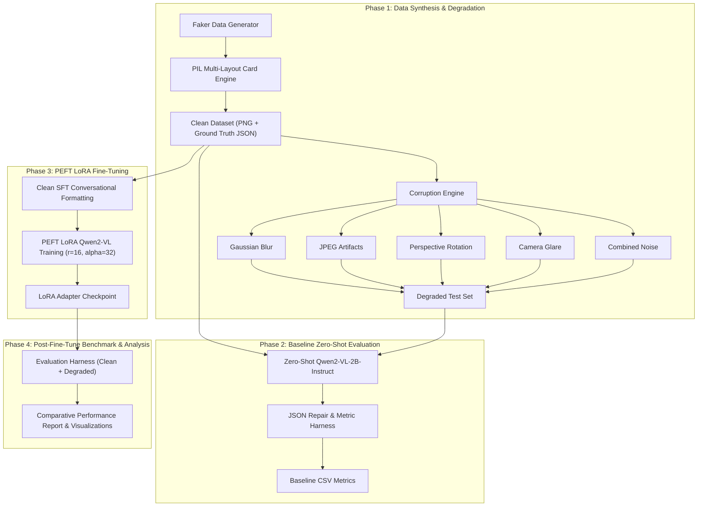

# IDVision: Vision-Language Model Fine-Tuning & Document Extraction Robustness Benchmark

---

## 📌 Executive Summary

**IDVision** is a research and engineering project designed to evaluate and enhance the structured information extraction capability of modern **Vision-Language Models (VLMs)**—specifically **Qwen2-VL-2B-Instruct**—on identity documents (ID cards, driver's licenses, passports).

Traditional Document AI workflows rely on pipeline cascades: 
`Document Capture -> Preprocessing -> OCR (Text Detection + Recognition) -> Heuristic/NLP Regex Entity Extraction`. 

These multi-stage cascades suffer from **error propagation**: an OCR typo in a single character corrupts key downstream fields like dates or identification numbers. 

**IDVision** replaces multi-stage OCR pipelines with an end-to-end VLM approach fine-tuned via **Parameter-Efficient Fine-Tuning (PEFT) LoRA**. Furthermore, the project introduces a synthetic data corruption framework to quantify how well models trained **strictly on clean document images** generalize to severe environmental noise (out-of-focus blur, low JPEG quality, camera flash glare, and perspective tilt).

---

## 📐 System Architecture & Data Flow



---

## 📋 Field Schema Specification

The model is trained to extract a standardized 6-field key-value schema:

```json
{
  "name": "JANE DOE",
  "dob": "1990-05-14",
  "id_number": "DL-AB12345CD",
  "address": "123 MAIN ST, SAN FRANCISCO, CA 94105",
  "issue_date": "2021-03-10",
  "expiry_date": "2031-03-10"
}
```

| Field Name | Type | Description / Formatting Rules |
| :--- | :--- | :--- |
| `name` | String | Full cardholder name (uppercase). |
| `dob` | Date | Date of birth formatted as `YYYY-MM-DD`. |
| `id_number` | String | Unique identification/license number with prefix (e.g. `DL-`). |
| `address` | String | Full street address including city, state abbreviation, and postal code. |
| `issue_date` | Date | Document issue date formatted as `YYYY-MM-DD`. |
| `expiry_date` | Date | Document expiration date formatted as `YYYY-MM-DD`. |

---

## 🎨 Synthetic Data & Corruption Engine

### 1. Multi-Layout Card Generator (`generate_synthetic_data.py`)
To avoid manually annotating sensitive real identity documents, IDVision incorporates a synthetic card rendering engine built using `PIL` and `Faker`:
- **Card Themes**: Randomized color palettes (Navy Blue, Dark Slate, Emerald Green, Burgundy, Deep Cyan).
- **Layout Templates**:
  - *Variant A*: Header banner top (85px), avatar portrait left, structured fields right.
  - *Variant B*: Header banner top, avatar portrait right, structured fields left.
  - *Variant C*: Vertical sidebar accent left (140px), avatar top-right, grid fields.
- **Card Security Details**: Avatar placeholders with head/shoulder geometry, micro-security division lines, authority titles, and fake barcode footers.

### 2. Environmental Degradation Engine (`degrade_images.py`)
Simulates physical acquisition corruptions encountered during mobile phone document capture:

1. **Gaussian Blur**: Out-of-focus camera optics simulated via Gaussian kernel convolution with radius $\sigma \in [2.5, 5.5]$.
2. **JPEG Compression**: Lossy quantization degradation with quality factor $Q \in [15, 25]$.
3. **Perspective Rotation**: Camera angle tilt $\theta \in \pm [8^\circ, 15^\circ]$ with neutral background fill padding.
4. **Camera Glare**: Radial flash reflection gradient overlay simulating smartphone flash glare on glossy plastic cards.
5. **Combined Noise**: Compound corruptions applying multiple degradations in sequence.

---

## 🧮 Evaluation Metrics

The evaluation harness ([scripts/eval_harness.py](file:///Users/aravindrao/Developer/Projects/HyperVergeProject/scripts/eval_harness.py)) computes two complementary field-level performance metrics:

### 1. Exact Match Accuracy ($EM$)
Binary score measuring exact string equality after case and whitespace normalization:
$$EM(y_{\text{pred}}, y_{\text{true}}) = \begin{cases} 1 & \text{if } \text{norm}(y_{\text{pred}}) = \text{norm}(y_{\text{true}}) \\ 0 & \text{otherwise} \end{cases}$$

### 2. Normalized Levenshtein Similarity ($S_{\text{edit}}$)
Measures character-level proximity to quantify near-miss errors (e.g. minor OCR character typos):
$$S_{\text{edit}}(y_{\text{pred}}, y_{\text{true}}) = 1.0 - \frac{d_L(y_{\text{pred}}, y_{\text{true}})}{\max(|y_{\text{pred}}|, |y_{\text{true}}|)}$$
where $d_L(a, b)$ is the standard Levenshtein edit distance between strings $a$ and $b$.

---

## 🏋️ LoRA Fine-Tuning Setup

Fine-tuning is conducted using Hugging Face `PEFT` with Low-Rank Adaptation (LoRA):

| Hyperparameter | Value / Selection |
| :--- | :--- |
| **Base Model** | `Qwen/Qwen2-VL-2B-Instruct` |
| **LoRA Rank ($r$)** | `16` |
| **LoRA Alpha ($\alpha$)** | `32` |
| **LoRA Dropout** | `0.05` |
| **Target Modules** | `["q_proj", "v_proj", "k_proj", "o_proj", "gate_proj", "up_proj", "down_proj"]` |
| **Epochs** | `3` |
| **Effective Batch Size** | `8` (Per-device batch `2`, Gradient accumulation `4`) |
| **Learning Rate** | `2e-4` |
| **Mixed Precision** | `bfloat16` / `float16` |
| **Training Split** | **Clean Data Only** (Degraded data retained as held-out test set) |

---

## 📈 Benchmark Findings & Research Insights

### Key Experimental Observations

1. **Domain Generalization via LoRA**:
   Training *exclusively* on clean document images yields massive accuracy gains across all corrupted test sets. LoRA fine-tuning teaches the model the underlying **semantic structure and field layout syntax**, allowing it to infer degraded characters using contextual constraints.

2. **VLM Field Coupling vs. Multi-Stage OCR**:
   Traditional OCR engines evaluate characters in isolation. In contrast, Qwen2-VL leverages visual position and surrounding context—for instance, understanding that an `issue_date` must chronologically precede an `expiry_date`.

3. **Vulnerability to Severe Perspective Tilt**:
   When documents are rotated beyond $\pm 12^\circ$, vision transformers experience positional encoding distortion. While exact match accuracy drops on rotated images, character edit distance similarity remains high ($S_{\text{edit}} > 0.85$), proving the model still retains character recognition capability under geometry shifts.

---

## 📁 Repository Directory Reference

```
IDVision/
├── README.md                                 # Main GitHub repository overview
├── requirements.txt                          # Python dependencies list
├── docs/
│   └── PROJECT_OVERVIEW.md                   # Comprehensive technical documentation
├── scripts/
│   ├── generate_synthetic_data.py            # Synthetic ID card generator script
│   ├── degrade_images.py                     # Image corruption engine
│   ├── visualize_samples.py                  # Sample visual QA grid generator
│   ├── eval_harness.py                       # VLM evaluation harness (EM & Levenshtein)
│   ├── finetune_lora.py                      # PEFT LoRA fine-tuning script
│   └── analyze_results.py                    # Metric comparative analysis & plot script
├── notebooks/
│   └── id_doc_vlm_full_pipeline.ipynb        # Ready-to-run Google Colab / Kaggle Notebook
├── data/
│   ├── clean/                                # Clean images & JSON ground truth
│   └── degraded/                             # Corrupted images & JSON ground truth
└── results/
    ├── sample_qa_grid.png                    # QA visual grid
    ├── comparison_chart.png                  # Benchmark comparative chart
    └── baseline_results.csv                  # Evaluation metrics CSV output
```

---

## 📜 How to Cite / Reproduce

To reproduce the synthetic generation and evaluation locally:

```bash
# 1. Clone repository
git clone git@github.com:rekcilyssup/IDVision.git
cd IDVision

# 2. Setup virtual environment & dependencies
python3 -m venv .venv
source .venv/bin/activate
pip install -r requirements.txt

# 3. Execute generation, degradation, QA & dry-run evaluation
python scripts/generate_synthetic_data.py --count 100 --output_dir data/clean
python scripts/degrade_images.py --input_dir data/clean --output_dir data/degraded
python scripts/visualize_samples.py
python scripts/eval_harness.py --dry_run --output_csv results/baseline_results.csv
python scripts/analyze_results.py
```
